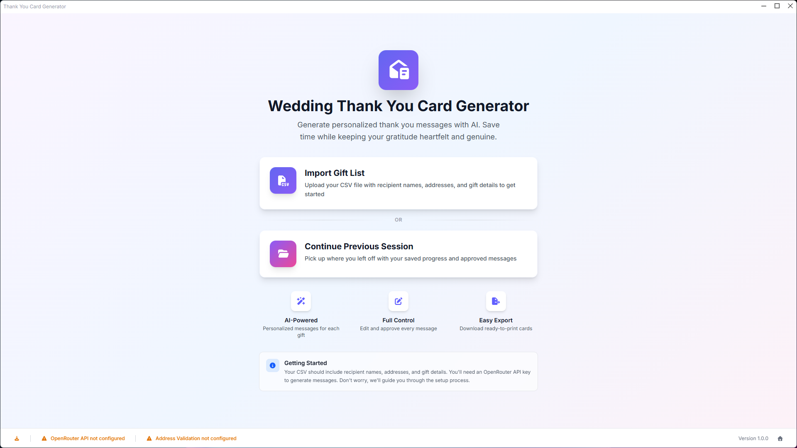

# Wedding Thank You Card Generator

Generate personalized thank you messages for your wedding guests using AI. Save time while keeping your gratitude heartfelt and genuine.



## Features

- **AI-Powered Messages** - Generate unique, personalized thank you messages for each gift using OpenRouter AI
- **CSV Import** - Upload your gift list with recipient names, addresses, and gift details
- **Full Control** - Edit, regenerate, and approve every message before exporting
- **Address Validation** - Validate recipient addresses using Google Maps integration
- **Session Management** - Save your progress and continue later with `.tycard` session files
- **Easy Export** - Download your approved messages as a ready-to-use CSV

## Getting Started

### Prerequisites

- Node.js 18+
- An [OpenRouter](https://openrouter.ai/) API key for AI message generation

### Installation

1. Clone this repository

```bash
git clone https://github.com/yourusername/wedding-thank-you-card-generator.git
cd wedding-thank-you-card-generator
```

2. Install dependencies

```bash
npm install
```

3. Run the app

```bash
npm run start
```

### Usage

1. **Import your gift list** - Upload a CSV file containing recipient names, addresses, and gift details
2. **Map your columns** - Match your CSV columns to the required fields (name, address, gift, etc.)
3. **Validate addresses** (optional) - Verify recipient addresses using Google Maps
4. **Generate messages** - Use AI to create personalized thank you messages for each recipient
5. **Review and edit** - Approve, modify, or regenerate messages as needed
6. **Export** - Download your completed messages as a CSV file

## Development

```bash
# Run in development mode
npm run start

# Run unit tests
npm run test

# Run E2E tests
npm run test:e2e

# Lint code
npm run lint

# Format code
npm run format:write

# Package for distribution
npm run package
```

## Tech Stack

- [Electron](https://www.electronjs.org) - Desktop application framework
- [React](https://reactjs.org) - UI library
- [Tailwind CSS](https://tailwindcss.com) - Styling
- [shadcn/ui](https://ui.shadcn.com) - UI components
- [OpenRouter](https://openrouter.ai) - AI model access
- [TanStack Router](https://tanstack.com/router) - Routing

## License

This project is licensed under the MIT License - see the [LICENSE](LICENSE) file for details.
